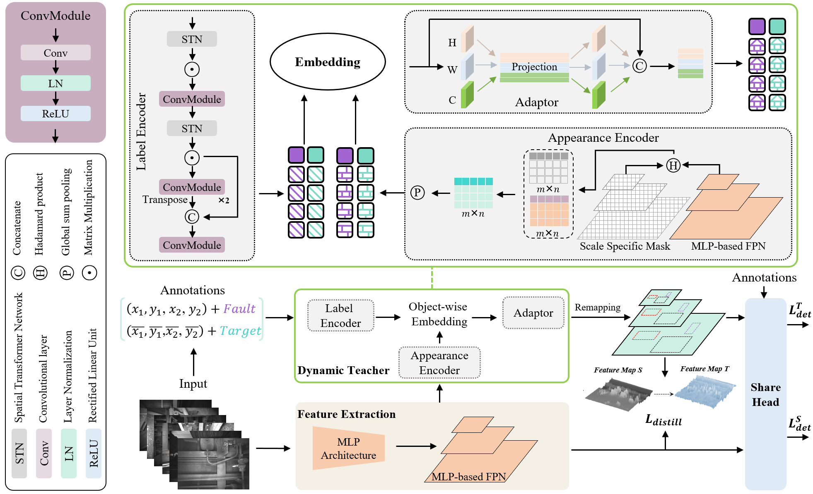

# Spatial-Wise Dynamic Distillation for MLP-Like Efficient Visual Fault Detection of Freight Trains
This is the official implementation of [Spatial-Wise Dynamic Distillation for MLP-Like Efficient Visual Fault Detection of Freight Trains](https://ieeexplore.ieee.org/abstract/document/10391271). 
# Table of Contents
* [Introduction](#jump1)
* [Installation](#jump2)
* [Usage](#jump3)
* [Citation](#jump4) 
***

# <span id="jump1">Introduction</span>
<div align="center"> </div>

**Fig. 2.** Overview of the proposed MLP-like spatial-wise dynamic distillation method. We adopt a novel dynamic teacher architecture comprising three modules: label encoder, appearance encoder, and feature adaptive interaction.  The dynamic teacher enables joint teacher-student training, which generates instructional representations from ground truth annotations and feature pyramids during the training stage.

# <span id="jump2">Installation</span>

This codebase is built upon [Detectron2](https://detectron2.readthedocs.io/en/latest/).
* Ubuntu 18.04 LTS, CUDA>=10.1, GCC>=7.5.0
* Python>=3.7.13
* Detectron2==0.3
* Pytorch>=1.7.1, torchvision>=0.8.2

1、Clone this repo：
```
git clone https://github.com/MVME-HBUT/SDD-FTI-FDet.git
cd SDD-FTI-FDet
```

2、Please install Detectron2 following the official guide: [INSTALL.md](https://detectron2.readthedocs.io/en/latest/tutorials/install.html).

3、Then create a conda virtual environment and activate it:
```
conda create -n SDD python=3.7 -y
conda activate SDD
```
4、Other requirements
```
pip3 install -r requirements.txt
```


# <span id="jump3">Usage</span>
## Prepare your own datasets
For instance, downloading [MS-COCO](https://cocodataset.org/) whose hierarchy is organized as follows:
```
MSCOCO
  |_ annotations
    |_ instances_train2017.json
    |_ instances_val2017.json
  |_ train2017
  |_ val2017

mkdir ${PROJ}/datasets
ln -s /path/to/MSCOCO datasets/coco
```

## Train
```
python3 train.py --config-file configs/Distillation/SDD.yaml --num-gpus 1
```
## Evaluation
It is handy to add [--eval-only] option to turn training command into evaluation usage.
```
python3 train.py --eval-only --config-file configs/Distillation/SDD.yaml --num-gpus 1
```
## Visualization
```
python3 SDD-FTI-FDet/utils/result_vis.py
```


# <span id="jump4">Citation</span>
If you find this repository useful in your research, please consider citing:
```
@ARTICLE{10391271,
  author={Zhang, Yang and Pan, Huilin and Li, Mingying and Wang, An and Zhou, Yang and Ren, Hongliang},
  journal={IEEE Transactions on Industrial Electronics}, 
  title={Spatial-Wise Dynamic Distillation for MLP-Like Efficient Visual Fault Detection of Freight Trains}, 
  year={2024},
  volume={71},
  number={10},
  pages={13168-13177},
  keywords={Fault detection;Detectors;Feature extraction;Training;Visualization;Task analysis;Computational modeling;Dynamic distillation;fault detection;freight train images;multilayer perceptron (MLP)},
  doi={10.1109/TIE.2023.3344837}}
```
